# Warwick/SJTU Global Challenge

*No-Poverty Group*

TL;DR: Research notes from a UK-China student collaboration on poverty, migration, and mental health. Our group ranked first among eight teams.

## Our Research

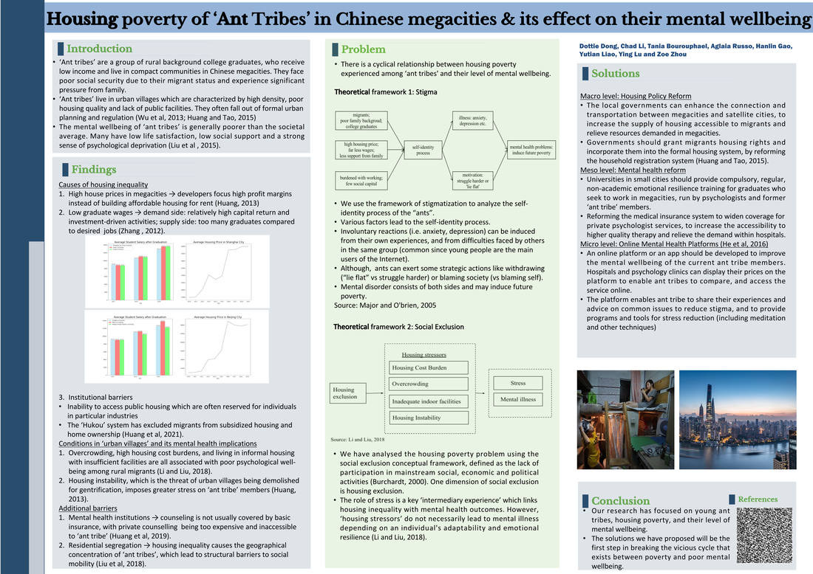

References:

- [Draft Speech](https://www.dropbox.com/s/0755220if8szd04/draft_speech.pdf?dl=0)
- [Research Document](https://www.dropbox.com/s/v6dvdbgd2zv15pw/no_poverty_group_2____.pdf?dl=0)

## Suggested Readings

- Shou H. Globalizing the Chinese Social Assistance Program: The Authoritarianism That Listens?[J]. International Journal of China Studies, 2016, 7.
- Li M, Walker R. Targeting Social Assistance: Dibao and Institutional Alienation in Rural China[J]. Social Policy & Administration, 2018.
- Golan J, Sicular T, Umapathi N. Unconditional Cash Transfers in China: Who Benefits from the Rural Minimum Living Standard Guarantee (Dibao) Program?[J]. World Development, 2017, 93:316-336.
- Distelhorst G, Hou Y. Ingroup Bias in Official Behavior: A National Field Experiment in China[J]. Social Science Electronic Publishing.
- Newman, Simon P. Embodied History: The Lives of the Poor in Early Philadelphia. Philadelpha, PA: University of Pennsylvania Press, 2013 [ebook]
- Ruswick, Brent. Almost worthy: the poor, paupers, and the science of charity in America, 1877-1917. Bloomington, IN: Indiana University Press, 2013 [ebook]
- Williams, Samantha. Poverty, Gender and life-cycle under the English poor law, 1760-1834. Suffolk: Boydell and Brewer, 2011. [ebook]
- Boon, B., & Farnsworth, J. (2011). Social Exclusion and Poverty: Translating Social Capital into Accessible Resources. Social Policy & Administration, 45, 507-524. doi:10.1111/j.1467-9515.2011.00792.x
- Huang, Y., & Tao, R. (2015). Housing migrants in Chinese cities: current status and policy design. Environment and Planning C: Government and Policy, 33(3), 640-660. doi:10.1068/c12120
- Huang, D., Yang, L. H., & Pescosolido, B. A. (2019). Understanding the public's profile of mental health literacy in China: a nationwide study. BMC Psychiatry, 19(1).
- Li, J., & Liu, Z. (2018). Housing stress and mental health of migrant populations in urban China. Cities, 81. doi:10.1016/j.cities.2018.04.006
- Liu, L., Huang, Y., & Zhang, W. (2018). Residential segregation and perceptions of social integration in Shanghai, China. Urban Studies, 55(7), 1484-1503. https://doi.org/10.1177/0042098016689012
- Liu, B., Pu, J., & Hou, H. (2015). Effect of perceived stress on depression of Chinese "Ant Tribe" and the moderating role of dispositional optimism. Journal of health psychology, 21. doi:10.1177/1359105315583373
- Major, B., & O'brien, L. T. (2005). The social psychology of stigma. Annu. Rev. Psychol., 56, 393-421.
- Morgan, C., Burns, T., Fitzpatrick, R., Pinfold, V., & Priebe, S. (2007). Social exclusion and mental health: conceptual and methodological review. The British journal of psychiatry : the journal of mental science, 191, 477-483. https://doi.org/10.1192/bjp.bp.106.034942
- Zhang, X. (2013). China's "Ant Tribe" Present Social Survival Situation and Personal Financial Advice. Asian Social Science, 9, 24-35. doi:10.5539/ass.v9n2p24

## Programme Sessions

### Plenary - Introduction and Welcome

What is this programme about?

- Redesigning UK-China Mobility: Warwick - SJTU Partnership
- Innovative and exciting learning opportunity that is locally, nationally and internationally relevant
- Developing intercultural skills and global mindset

And then COVID-19 disrupted plans but also enabled us to grow the programme.

An academic team of world leading experts. Complementary opportunities for student research:

- ICUR
- Reinvention
- ...build a dynamic community of opportunity

What you will get from participating:

- Global learning experience
- Global teamwork
- Global problem solving
- Global community

What do I do if I have a technical or other problems? Please contact: globalchllenge@warwick.ac.uk

### Intercultural Core Training Session I - all students

- "Introducing Yourself"
- "Agree or Disagree Statements"
- "Playing Counting Games with Different Rules"

### Intercultural Core Training Session II - all students

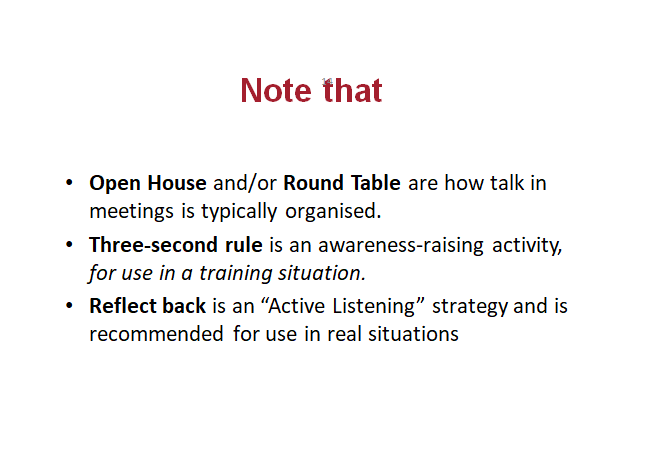

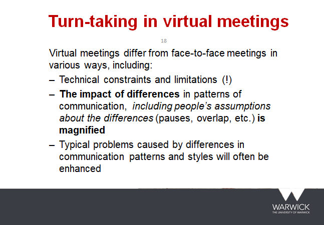

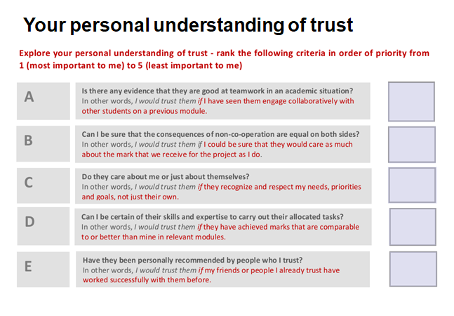

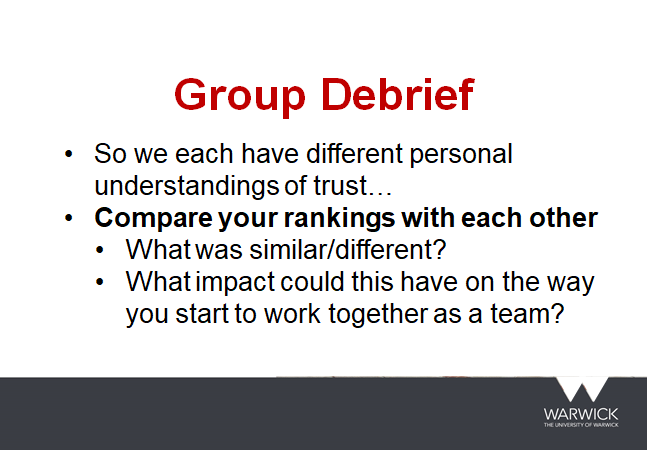

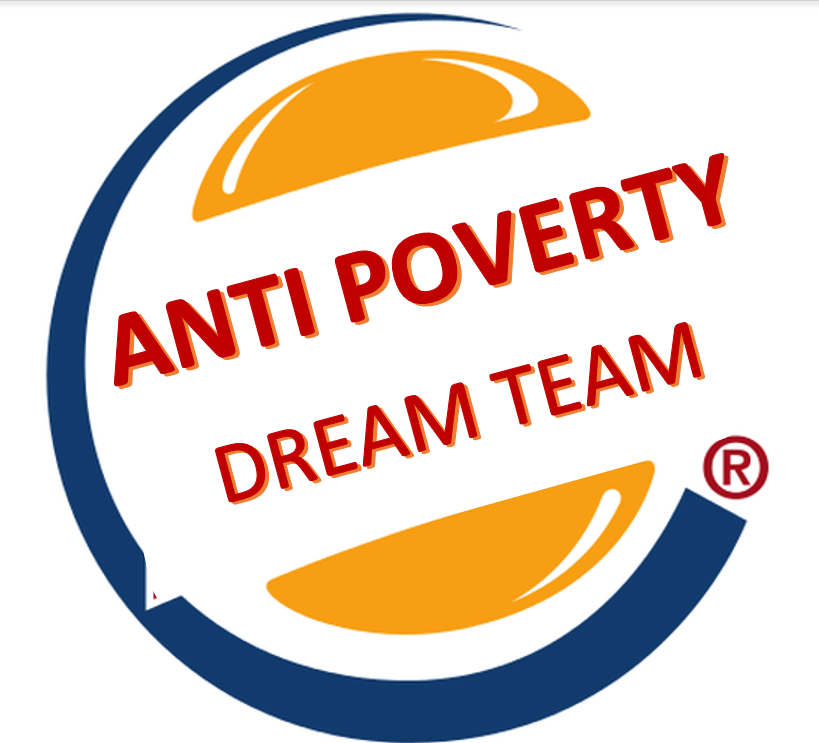

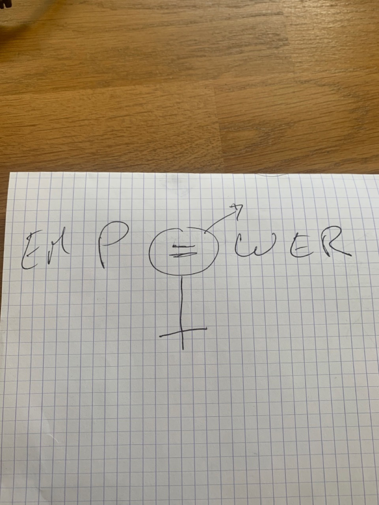

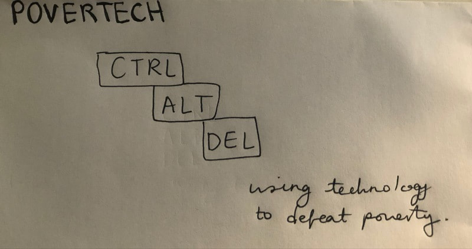

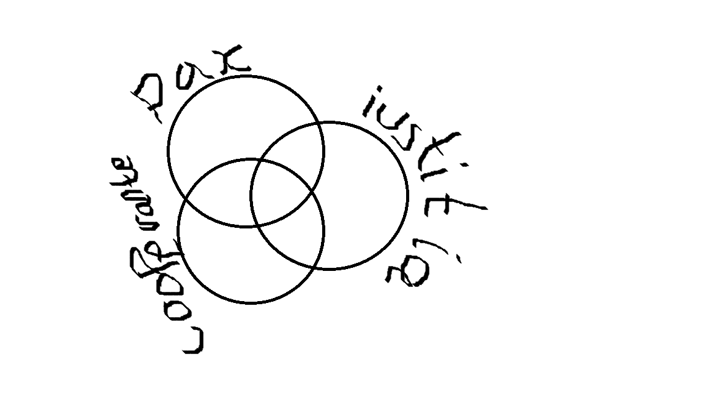

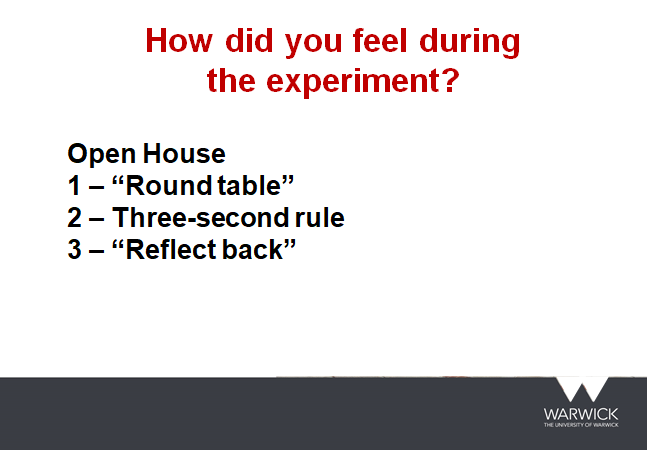

### Intercultural Core Training Session III - all students

- Gave orders for 9 tasks and discuss why?
- Wrote emails to others in urgent situations, and wrote comments to others' emails, then discussed the comments.
- Gave feedback face to face.

### Academic Session I

Absent.

### Academic Session II

Absent.

### Student-led Research Activity I

Did some research on:

- Mental health and poverty research
- Young people and mental health engagement
- Reasonable tuition to their current status
- Institutions and how it influences poverty
- Economic embarrassment faced by young people who just graduated school
- ...

### Student-led Research Activity II

Met with professor Yang. Chose a specific topic:

- International migrants from the UK
- Rural to urban migration in China
- Compare them (including mental health)

### Intercultural Learning Activity

Discussed the feelings of working in teams.

### Student-led Research Activity III

Made a presentation to professors. [pdf](https://www.dropbox.com/s/fl7ednoa2ccqc3q/thursday_presentation_.pdf?dl=0)

### Student-led Research Activity IV

Discussed more details of the project.

### Student-led Research Activity V

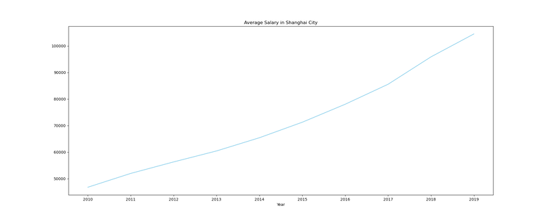

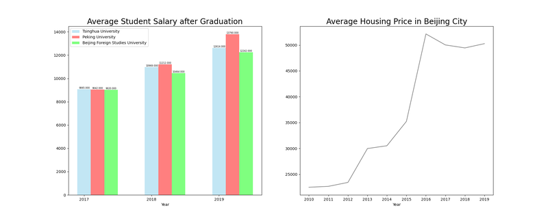

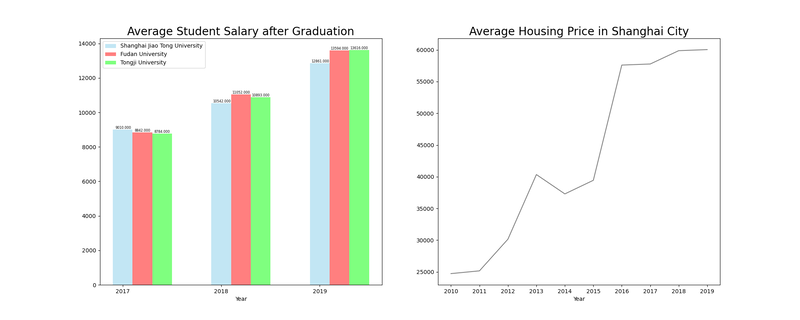

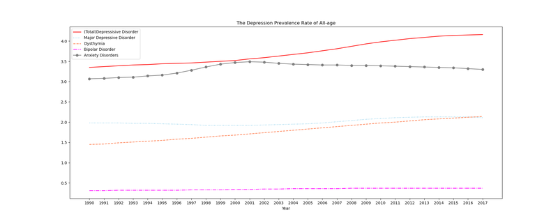

I had done some data analysis (shown above).

Professor Dakkak, Nadeen told us about:

- The requirement of final poster
- How to write a poster

Discussed more details of writing the poster, and we chose one member to be the speaker.

### Student-led Research Activity VI

Absent.

### Topic Group Meetings

Absent.

### Finalise group presentations and posters I

Discussed all details about final presentations and posters.

### Finalise group presentations and posters II

Discussed all details about final presentations and posters.

### Presentation of research outcomes

Ranked #1 among 8 groups.

### Learning Activity

Absent.
