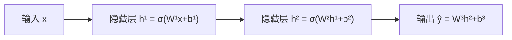
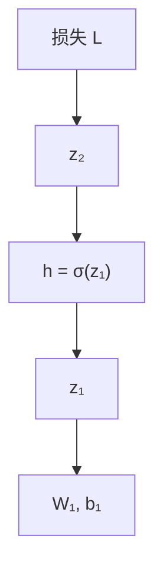
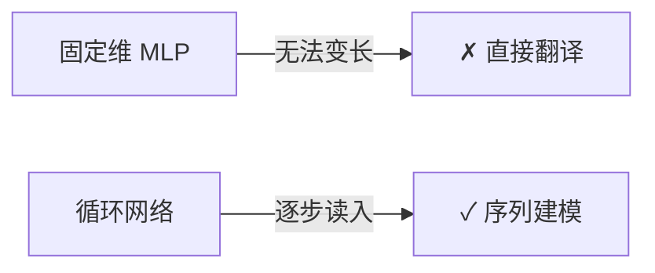

从**标量函数拟合**到**多层感知机（MLP, Multi-Layer Perceptron）**，理解后续 RNN、LSTM、Attention 的共同语言：向量、矩阵乘法、非线性与梯度下降。

> **读完本篇你将能够**：描述一次前向传播与反向传播；解释为何固定维度的前馈网络无法直接做机器翻译；知道进入 RNN 篇之前需要掌握哪些符号。

## 1. 神经网络在做什么

**通俗说法**：神经网络是一组可学习的「旋钮」（权重 $W$ 和偏置 $b$），通过大量例子把输入映射到期望输出。

**专业说法**：复合可微函数 $f_\theta(x)$，通过经验风险最小化 $\min_\theta \mathcal{L}(f_\theta(x), y)$ 拟合数据分布。

### 1.1 从线性模型到非线性

线性模型 $\hat{y} = w^\top x + b$ 只能画直线/超平面。加入**激活函数（activation）** $\sigma$ 后：

$$
h = \sigma(Wx + b), \quad \hat{y} = W_{out} h + b_{out}
$$

常见 $\sigma$：

| 激活 | 公式 | 特点 |
| --- | --- | --- |
| ReLU | $\max(0, z)$ | 训练快，现代 CNN/Transformer 主流 |
| tanh | $\frac{e^z - e^{-z}}{e^z + e^{-z}}$ | 输出 $[-1,1]$，RNN 常用 |
| sigmoid | $\frac{1}{1+e^{-z}}$ | 输出 $(0,1)$，门控网络常用 |

**直觉**：没有非线性，堆再多层仍等价于一层线性变换——「深度」失去意义。

## 2. 前向传播（Forward Pass）

以两层网络为例。设输入 $x \in \mathbb{R}^{d_{in}}$，隐藏层 $h \in \mathbb{R}^{d_h}$，输出 $\hat{y} \in \mathbb{R}^{d_{out}}$：

$$
z_1 = W_1 x + b_1, \quad h = \sigma(z_1)
$$
$$
z_2 = W_2 h + b_2, \quad \hat{y} = \sigma(z_2) \;\text{（或线性输出层）}
$$

**词嵌入视角**（为 NLP 铺垫）：机器翻译中 $x$ 往往是**词向量（word embedding）**——把离散词 ID 映射到连续向量，使语义相近的词距离更近。

## 3. 损失函数与训练目标

给定标注对 $(x, y)$，定义损失 $\mathcal{L}(\hat{y}, y)$：

| 任务类型 | 典型损失 | 说明 |
| --- | --- | --- |
| 回归 | MSE $\frac{1}{2}\|\hat{y}-y\|^2$ | 拟合实数 |
| 分类 | 交叉熵 $-\sum_i y_i \log \hat{y}_i$ | 多类分类、语言模型下一词预测 |

**训练**即寻找参数 $\theta = \{W_1,b_1,W_2,b_2,\ldots\}$ 使训练集上平均损失最小：

$$
\theta^* = \arg\min_\theta \frac{1}{N}\sum_{i=1}^{N} \mathcal{L}(f_\theta(x^{(i)}), y^{(i)})
$$

## 4. 反向传播（Backpropagation）

**通俗说法**：从输出端的误差出发，用链式法则一层层算「每个旋钮该拧多少」——即 $\partial \mathcal{L}/\partial W$。

**专业说法**：计算图上的自动微分；对复合函数 $L = \mathcal{L}(f_2(f_1(x)))$：

$$
\frac{\partial L}{\partial W_1} = \frac{\partial L}{\partial z_2}\cdot\frac{\partial z_2}{\partial h}\cdot\frac{\partial h}{\partial z_1}\cdot\frac{\partial z_1}{\partial W_1}
$$

### 4.1 梯度下降（Gradient Descent）

$$
\theta \leftarrow \theta - \eta \,\nabla_\theta \mathcal{L}
$$

$\eta$ 为**学习率（learning rate）**。实践常用 **SGD / Adam** 等变体，配合 mini-batch。

### 4.2 常见问题

| 现象 | 原因 | 常见对策 |
| --- | --- | --- |
| 损失不降 | 学习率过大/过小、初始化差 | 调 $\eta$、Xavier/He 初始化 |
| 过拟合 | 模型容量 > 数据量 | Dropout、正则化、更多数据 |
| 梯度爆炸 | 连乘雅可比谱半径 > 1 | 梯度裁剪（RNN/LSTM 篇详述） |

## 5. 深度前馈网络（DNN / MLP）

**深度** = 多个隐藏层。优势：

- **层次特征**：浅层捕捉局部模式，深层组合为抽象概念（边缘 → 形状 → 物体；词 → 短语 → 句意）。
- **表达能力**：理论上足够宽的 MLP 可逼近连续函数（通用逼近定理）。

**代价**：参数量 $\propto$ 层宽平方；需要更多数据与算力。

## 6. 为何固定维度 DNN 做不了 Seq→Seq

论文 Sutskever (2014) 中的 **DNN** 特指**前馈网络**：构图时输入、输出向量维度固定。

| 例句 | 输入词数 | 输出词数 |
| --- | --- | --- |
| `I love you` → `Je t'aime` | 3 | 2 |
| 长论文摘要 | ~20 | ~27 |

翻译等任务的输入、输出长度**事先未知**。若硬塞进长度 100 的向量：

- 短句浪费维度，长句无法容纳；
- 不同样本接口不一致——不是「多训几次」能解决的，是**结构不匹配**。

> *Despite their flexibility and power, DNNs can only be applied to problems whose inputs and targets can be sensibly encoded with vectors of fixed dimensionality.* — Sutskever et al.

**出路**：需要能按时间步处理**变长序列**的架构 → [RNN](./02-rnn) → [LSTM](./03-lstm) → Seq2Seq → Attention → Transformer / Agent 上下文。

## 7. 与后续主题的衔接

| 概念 | 本篇 | 下游 |
| --- | --- | --- |
| 矩阵乘法 $Wx+b$ | 每层核心运算 | RNN 每时间步复用同一 $W$ |
| 激活 / 非线性 | 表达力来源 | tanh、sigmoid 门控 |
| 反向传播 | 训练通用框架 | BPTT 是其时间展开版 |
| 交叉熵 + softmax | 分类损失 | 语言模型每步预测下一词 |
| 固定维限制 | Seq2Seq 动机 | Encoder-Decoder 读 [Seq2Seq 教程](../02-attention/01-seq2seq-tutorial) |

## 8. 延伸阅读

| 资源 | 适合 |
| --- | --- |
| [Neural Networks and Deep Learning (Nielsen)](http://neuralnetworksanddeeplearning.com/) | 可视化入门，反向传播直觉极佳 |
| [Deep Learning (Goodfellow) Ch.6](https://www.deeplearningbook.org/) | 前馈网络、深度架构正式定义 |
| [3Blue1Brown — 神经网络](https://www.youtube.com/watch?v=aircAruvnKk) | 直觉向视频 |
| [CS231n Notes](https://cs231n.github.io/) | 反向传播推导练习 |

---

**下一篇**：[RNN — 循环神经网络与长期依赖](./02-rnn)
