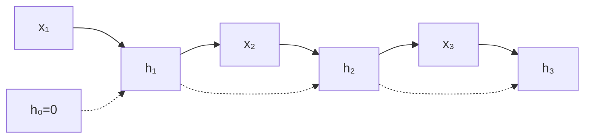

**循环神经网络（RNN, Recurrent Neural Network）** 在每一步读入序列中的一个元素，并维护一个**隐藏状态（hidden state）** $h_t$——可理解为「到目前为止读过的内容的压缩摘要」。

> **读完本篇你将能够**：写出标准 RNN 更新式；解释 BPTT 与梯度消失；说明为何 Seq2Seq 仍面临长依赖困难。

## 1. 为什么需要 RNN

[神经网络基础](./01-neural-networks) 指出：前馈 DNN 要求固定维输入/输出。自然语言、语音、时间序列的长度可变。

**通俗说法**：RNN 像一边读一边做笔记；每读一个新词，就更新笔记，而不是把整本书一次性塞进固定大小的信封。

**专业说法**：对序列 $x_1,\ldots,x_T$ 学习条件分布 $p(x_t \mid x_{<t})$ 或序列到序列映射，通过共享参数的时间递归结构实现。



## 2. 标准 RNN 更新

论文 §2（Sutskever 2014）形式（实践中隐藏层常用 **tanh** 替代 sigmoid）：

$$
h_t = \sigma(W_{hx} x_t + W_{hh} h_{t-1} + b_h)
$$
$$
y_t = W_{yh} h_t + b_y
$$

| 符号 | 含义 |
| --- | --- |
| $x_t$ | 时刻 $t$ 的输入（如词向量） |
| $h_t$ | 隐藏状态，携带历史摘要 |
| $W_{hx}$ | 输入到隐藏的权重 |
| $W_{hh}$ | 隐藏到隐藏（**同一套参数每个时间步复用**） |
| $y_t$ | 时刻 $t$ 的输出（如下一词 logits） |

**直觉**：$h_t = \text{变换}(\text{新信息 } W_{hx}x_t) + \text{变换}(\text{旧记忆 } W_{hh}h_{t-1})$，再经非线性压缩。

### 2.1 数值直觉：有损压缩

设 $h_t \in \mathbb{R}^2$，$W_{hh} = 0.5 \cdot I$，读入三个词后早期信息会衰减——$h_t$ 是**有损摘要**，不是完美记忆。

| 时刻 | 词 | $h_t$（示意） |
| --- | --- | --- |
| 1 | I | $[0.76,\, 0.00]$ |
| 2 | love | $[0.46,\, 0.76]$ |
| 3 | you | $[0.28,\, 0.46]$ |

句首 "I" 的信号在 3 步后已明显减弱；句子更长时更早信息更弱——这是**优化困难**，不是「记忆力不够」的魔法解释。

## 3. 沿时间展开（Unrolling）

RNN 沿时间轴展开后，等价于**权重共享的极深前馈网络**：

$$
h_1 \to h_2 \to \cdots \to h_T
$$

同一 $W_{hx}, W_{hh}$ 在所有步复用。训练时的 **BPTT（Backpropagation Through Time，沿时间反向传播）** 就是把这条链展开，从 $t=T$ 向 $t=1$ 反向传梯度。

## 4. 训练：Teacher Forcing 与损失

以语言建模为例，目标序列 $y_1^*,\ldots,y_T^*$，每步预测下一词分布，损失为负对数似然：

$$
L = -\sum_{t=1}^{T} \log p(y_t^* \mid y_{1}^*,\ldots,y_{t-1}^*, x)
$$

**Teacher Forcing**：训练时把**正确**的上一词作为下一步输入，而非模型自己的预测——加速收敛，但与推理时自回归生成存在 **exposure bias**（训练/测试分布不一致）。

## 5. 长期依赖与梯度消失 / 爆炸

考虑代词回指：*… the journal finally accepted **it**.* 中 *it* 指远处的 *paper*，信息须穿过十余个时间步。

损失对早期状态的梯度含连乘项：

$$
\frac{\partial h_T}{\partial h_1} = \prod_{i=2}^{T} \frac{\partial h_i}{\partial h_{i-1}}
$$

若每步雅可比范数平均 $< 1$（如 $0.9^{15} \approx 0.21$），梯度**指数衰减**（**vanishing gradient**）；若 $> 1$ 则**爆炸**（**exploding gradient**）。

| 现象 | 训练表现 | 含义 |
| --- | --- | --- |
| 梯度消失 | 早期时间步几乎学不到 | 难以学到远距离依赖 |
| 梯度爆炸 | 权重更新失控、NaN | 需梯度裁剪 |

**要点**：RNN **理论上**可表示长依赖，但**优化上**很难学到——这是 LSTM、Attention、Transformer 出现的核心动机之一。

## 6. Seq2Seq 为何加剧该问题

Encoder 读完整个源句才得到 $h_T$，Decoder 再开始生成。若 Decoder 首词依赖源句开头，信息路径 ≈ **编码步数 + 解码步数**，长句上可超 100 步，梯度路径更长。

```
源句: A → B → C → … → h_T → Decoder 生成 …
```

## 7. RNN 优缺点小结

| 优点 | 缺点 |
| --- | --- |
| 处理变长序列，参数共享 | 长程梯度困难 |
| 结构简单，易于理解 | 难以并行（逐步依赖 $h_{t-1}$） |
| 在线 / 流式处理 | 单向 RNN 只见过去，不见未来（BiRNN 可缓解） |

## 8. 与后续主题的衔接

- **LSTM**（[下一篇](./03-lstm)）：通过门控与 cell state 改善梯度传播路径，是 2014 Seq2Seq 论文的骨干。
- **Attention / Transformer**：不再强迫所有信息挤进单个 $h_T$，直接建立任意位置间的连接。
- **Agent 上下文**：可类比「有限窗口内的状态压缩」——上下文窗口与记忆机制正在解决类似的「长依赖」问题。

## 9. 延伸阅读

| 资源 | 亮点 |
| --- | --- |
| [Karpathy — The Unreasonable Effectiveness of RNNs](https://karpathy.github.io/2015/05/21/rnn-effectiveness/) | 字符级语言模型，极简代码直觉 |
| [Colah — Understanding LSTM Networks](https://colah.github.io/posts/2015-08-Understanding-LSTMs/) | 从 RNN 问题过渡到 LSTM（下一篇预习） |
| [Jurafsky & Martin — Speech and Language Processing](https://web.stanford.edu/~jurafsky/slp3/) Ch.9–10 | NLP 教材中的 RNN 正式处理 |
| [Goodfellow — DL Book Ch.10](https://www.deeplearningbook.org/) | 序列建模与 RNN 数学框架 |

---

**上一篇**：[神经网络基础](./01-neural-networks) · **下一篇**：[LSTM](./03-lstm)
