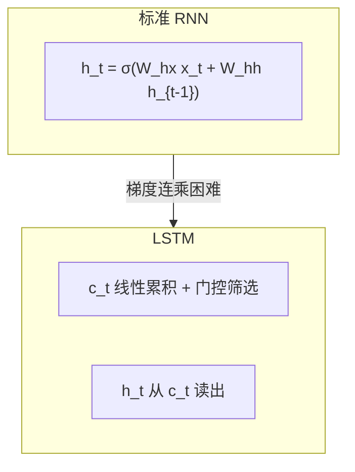
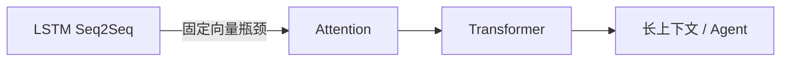

**长短期记忆网络（LSTM, Long Short-Term Memory）**（Hochreiter & Schmidhuber, 1997）通过**门控（gating）** 与独立的 **cell state（细胞状态）** $c_t$，缓解标准 RNN 的梯度消失，使长距离依赖在**优化层面**变得可行——Sutskever (2014) Seq2Seq 即建立在 4 层 LSTM 之上。

> **读完本篇你将能够**：解释四个门的作用；写出 cell state 更新式；理解梯度裁剪为何仍必要；知道 LSTM 之后为何还需要 Attention。

## 1. 动机：RNN 优化瓶颈

[上一篇](./02-rnn) 指出：$\partial h_T / \partial h_1$ 是连乘，长序列上梯度易消失。LSTM 的设计目标不是「增加魔法记忆力」，而是**提供一条梯度更易流动的路径**（cell state 上的近似线性传递）。

## 2. LSTM 结构概览

每个时间步维护两个状态：

| 状态 | 角色 | 通俗理解 |
| --- | --- | --- |
| $c_t$ | cell state | 「长期笔记本」，可跨步传递信息 |
| $h_t$ | hidden state | 「短期工作区」，用于输出与下一步输入 |

四个门（均为 sigmoid，输出 $(0,1)$，可微）：

| 门 | 符号 | 作用 |
| --- | --- | --- |
| 遗忘门 | $f_t$ | 决定丢弃多少旧 $c_{t-1}$ |
| 输入门 | $i_t$ | 决定写入多少新候选 |
| 候选 | $g_t$ | 拟写入的新内容（常经 tanh） |
| 输出门 | $o_t$ | 决定从 $c_t$ 读出多少到 $h_t$ |

## 3. 更新方程

$$
f_t = \sigma(W_f [h_{t-1}, x_t] + b_f)
$$
$$
i_t = \sigma(W_i [h_{t-1}, x_t] + b_i), \quad g_t = \tanh(W_g [h_{t-1}, x_t] + b_g)
$$
$$
c_t = f_t \odot c_{t-1} + i_t \odot g_t
$$
$$
o_t = \sigma(W_o [h_{t-1}, x_t] + b_o), \quad h_t = o_t \odot \tanh(c_t)
$$

其中 $\odot$ 为逐元素乘，$[h_{t-1}, x_t]$ 表示拼接。

**直觉**：

- $c_t$：在「擦掉旧内容」（$f_t$）与「写入新内容」（$i_t \cdot g_t$）之间平衡；
- $h_t$：从 $c_t$ 中**选择性读出**当前步需要的表示。

## 4. 与标准 RNN 对比

| 维度 | 标准 RNN | LSTM |
| --- | --- | --- |
| 状态 | 仅 $h_t$ | $c_t$ + $h_t$ |
| 梯度路径 | 每步经 $\sigma'$ 连乘 | $c_t$ 通道上可加性传递 |
| 参数量 | 较少 | 约 4 倍门控参数 |
| 长依赖 | 优化困难 | 显著改善（非保证完美） |
| 短序列 | 往往够用 | 可能过拟合 / 浪费算力 |

> LSTM 改善的是**梯度传播与优化**，不保证「记住一切」。表达能力上，理论上 RNN 已足够；难的是**训练**。

## 5. 训练实践

### 5.1 反向传播与 BPTT

与 RNN 相同：沿时间展开，共享 $W_f, W_i, W_g, W_o$ 等权重，反向累加各步梯度。

### 5.2 梯度裁剪（Gradient Clipping）

LSTM **缓解消失**，但**不消除爆炸**。Sutskever (2014) 对全局梯度范数设阈值（如 5）：

$$
\text{if } \|\nabla\| > \tau \text{ then } \nabla \leftarrow \frac{\tau}{\|\nabla\|}\nabla
$$

**通俗说法**：梯度太大时「踩刹车」，防止一步更新把权重甩飞。

### 5.3 其他技巧（Seq2Seq 论文也会用到）

- **源句反转**：缩短首词对齐路径（见 [Seq2Seq 教程](../02-attention/01-seq2seq-tutorial)）
- **分桶（bucketing）**：按句长分组 batch，减少 padding 浪费
- **深度 LSTM**：多层堆叠增强表示力（论文用 4 层）

## 6. LSTM 的局限 — 为何还需要 Attention

即使 LSTM 能训练长序列，**Encoder 把整个源句压进单个向量 $v$** 仍是瓶颈：

- 长句信息被迫挤进固定维向量；
- Decoder 每步只能「看」这一个 $v$，无法动态关注源句不同位置。

这直接引出 **Bahdanau Attention (2014)** 与后续 **Transformer (2017)**——也是理解现代 **Agent 上下文窗口** 与 **检索增强** 的历史背景。

## 7. 常见问题（FAQ）

**Q：LSTM 是否永远优于 RNN？**  
短序列、简单任务上 RNN 可能足够；LSTM 参数更多，小数据易过拟合。

**Q：LSTM 与 GRU？**  
GRU 是门控的简化版（两扇门），参数更少，许多任务效果接近。

**Q：现在还要学 LSTM 吗？**  
要。理解 Seq2Seq 论文、阅读经典 NMT 代码、掌握「门控 + 状态」思想，对读 Transformer 和 Agent 记忆机制仍有帮助。

## 8. 延伸阅读

| 资源 | 亮点 |
| --- | --- |
| [Colah — Understanding LSTM Networks](https://colah.github.io/posts/2015-08-Understanding-LSTMs/) | 最佳直觉图解，强烈推荐 |
| [Hochreiter & Schmidhuber (1997)](https://www.bioinf.jku.at/publications/older/2604.pdf) | 原始 LSTM 论文 |
| [Olah — LSTM 动画互动](https://colah.github.io/posts/2015-08-Understanding-LSTMs/) | 门控数据流可视化 |
| [Sutskever et al. (2014)](https://arxiv.org/abs/1409.3215) | 进入 [Seq2Seq 教程](../02-attention/01-seq2seq-tutorial) |

---

**上一篇**：[RNN](./02-rnn) · **下一篇**：[Seq2Seq 论文精读](../02-attention/01-seq2seq-tutorial)
