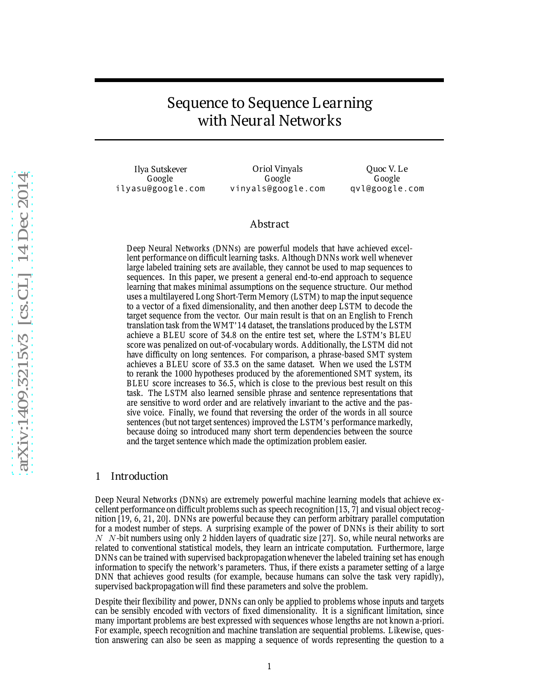
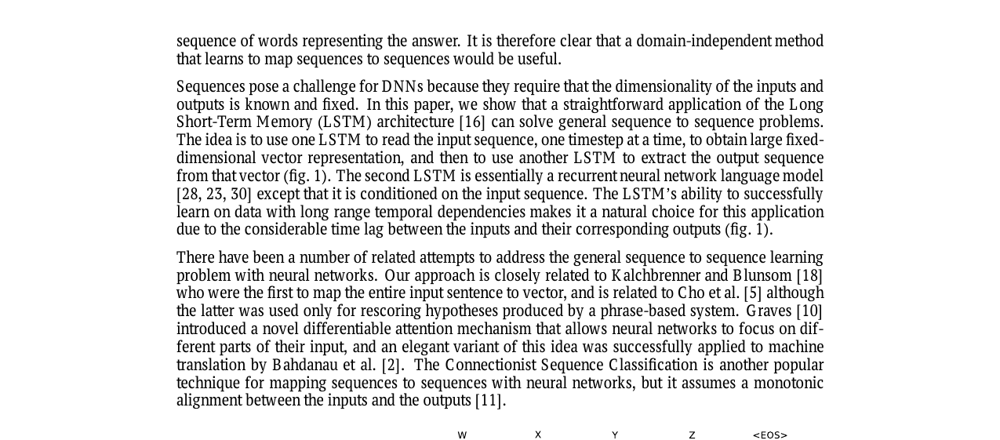
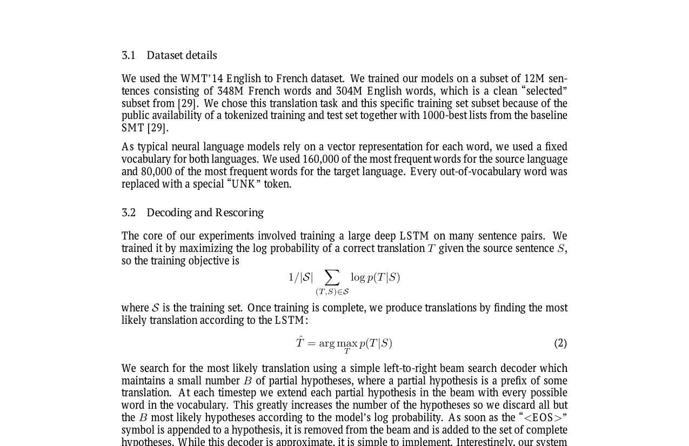
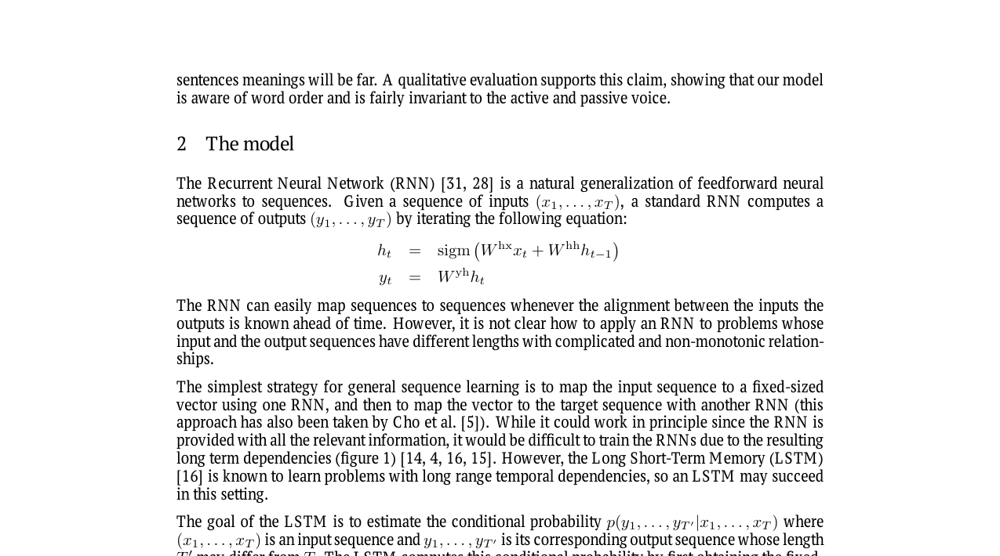
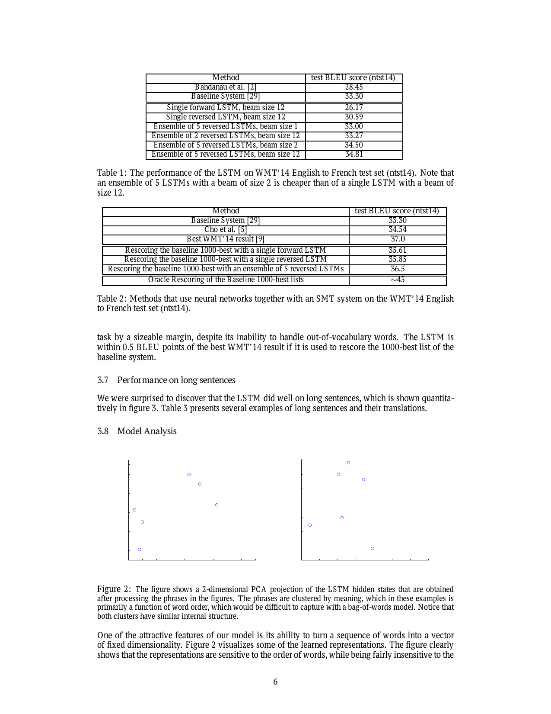

## 本教程说明

本篇精读 **Sutskever et al. (2014) — Sequence to Sequence Learning with Neural Networks**。

**前置阅读**（左侧「第一部分：数学基础」）：

- [神经网络](../01-math-foundations/01-neural-networks) — 前馈网络、反向传播、为何固定维度网络做不了翻译
- [RNN](../01-math-foundations/02-rnn) — 隐藏状态、BPTT、梯度消失/爆炸
- [LSTM](../01-math-foundations/03-lstm) — 门控机制、长依赖、训练稳定性

## 阅读路线

1. **论文背景** → 理解本文在 NMT 史上的位置
2. **模型架构 ~ 工程技巧** → Encoder-Decoder、双 LSTM、源句反转
3. **训练与解码** → 损失函数、Teacher Forcing、Beam Search
4. **实验与瓶颈** → BLEU、长句退化、Attention 铺垫
5. **速查与附录** → 术语表、Conclusion 译文

> 演进主线：2014 Sutskever — Seq2Seq + LSTM · 2014 Bahdanau — Attention · 2017 Transformer

## 论文背景与定位

《Sequence to Sequence Learning with Neural Networks》（2014）是现代 序列到序列（Sequence-to-Sequence，Seq2Seq）框架的开山之作，也是**神经机器翻译（Neural Machine Translation，NMT）**——用神经网络端到端完成翻译，而非传统统计流水线——真正开始的标志。

在这篇论文之前，将输入序列映射到输出序列通常依赖复杂的人工设计：语法规则、词对齐模型、翻译词典、人工特征等。本文首次在大规模任务上证明：**一个端到端神经网络可以直接学习「序列 → 序列」的映射**。

```
English sentence  →  Neural Network  →  French sentence
```



*图 0-1. 论文 Abstract 原文。核心结论：LSTM 在 WMT'14 英译法上 BLEU 34.8（BLEU：Bilingual Evaluation Understudy，机器翻译自动评测分数，比较译文与人工参考的 n-gram 重叠，越高越好），首次显著超越纯 SMT（Statistical Machine Translation，统计机器翻译）基线 33.3。*

> Deep Neural Networks (DNNs) are powerful models that have achieved excellent performance on difficult learning tasks. Although DNNs work well whenever large labeled training sets are available, **they cannot be used to map sequences to sequences**. 
> 
> *— Abstract, Sutskever et al. (2014)*

> 入门例子 · 论文在翻译任务上做了什么
> 假设输入英文 `I love you`，期望输出法文 `Je t'aime`。
> **实验 A · 独立神经翻译（Standalone NMT）**：模型自己从英文直接生成法文，不借助任何传统翻译系统。就像学生闭卷考试——全程靠神经网络。
> **实验 B · 重打分（Rescoring / Reranking）**：先让传统**统计机器翻译（Statistical Machine Translation，SMT）**系统给出 1000 个候选译文，再由 LSTM 给每个候选打分，选最高分的。就像先让多位译者各写一版草稿，再由评委挑出最好的一版。神经网络进入翻译领域时，常走 B 再走向 A。

## Seq2Seq 模型架构

论文方案：**编码器（Encoder）** LSTM 把整句源语言读完后压成一个固定向量 $v$；**解码器（Decoder）** LSTM 以 $v$ 为初始记忆，**自回归（autoregressive）**地一个词一个词生成目标语言——每生成一个词，就把它喂回 Decoder 作为下一步输入。

> 入门例子 · "I love you" → "Je t'aime" 全流程（简化）
> **① Encoder 读源句**：依次读 `I` → `love` → `you` → `<EOS>`（End Of Sequence，句末标记）。读完后末状态即为 $v$——整句英文的压缩表示。
> **② Decoder 生成法文**：以 $v$ 初始化，预测第一个词 → `Je`；把 `Je` 喂回，预测 → `t'aime`；再喂回，预测 → `<EOS>`，停止。
> **③ 概率怎么算**：每个位置对词表里所有词做 softmax（归一化指数函数，把分数变成概率分布），选出概率最高的词（或交给 Beam Search，见第 07 章）。

### 条件概率分解

$$p(y_{1},\\ldots ,y_{T′} | x_{1},\\ldots ,x_{T}) = \\prod _{t=1}^{T′} p(y_{t} | v, y_{1},\\ldots ,y_{t-1})$$

其中 $v$ 为 Encoder 最后时刻的隐藏状态；每个 $p(y_{t}|\\ldots )$ 为词表上的 softmax。句子以特殊符号 `<EOS>` 结束，从而对任意长度序列定义分布。

<div class="hello-agent-figure" v-pre>
<figure><svg viewBox="0 0 960 300" xmlns="http://www.w3.org/2000/svg"><defs><pattern id="dots4b" width="22" height="22" patternUnits="userSpaceOnUse"><circle cx="1" cy="1" r="0.9" fill="#E3E2DC"></circle></pattern></defs><rect width="100%" height="100%" fill="#f5f4ed"></rect><rect width="100%" height="100%" fill="url(#dots4b)" opacity="0.55"></rect><text x="80" y="38" fill="#9B1C1C" font-size="13" font-weight="600" font-family="monospace" letter-spacing="3">FIGURE 4b</text> <text x="210" y="38" fill="#504e49" font-size="13" font-family="monospace" letter-spacing="3">Softmax：分数 → 概率</text> <line x1="80" y1="52" x2="880" y2="52" stroke="#9B1C1C" stroke-width="0.8"></line><text x="100" y="95" fill="#504e49" font-size="13" font-weight="600">scores</text> <rect x="80" y="105" width="80" height="44" rx="4" fill="#faf9f5" stroke="#504e49"></rect><text x="120" y="132" fill="#141413" font-size="14" text-anchor="middle">Je: 2.0</text> <rect x="170" y="105" width="80" height="44" rx="4" fill="#faf9f5" stroke="#504e49"></rect><text x="210" y="132" fill="#141413" font-size="14" text-anchor="middle">t'aime: 1.0</text> <rect x="260" y="105" width="80" height="44" rx="4" fill="#faf9f5" stroke="#504e49"></rect><text x="300" y="132" fill="#141413" font-size="14" text-anchor="middle">vous: 0.5</text> <text x="370" y="132" fill="#9B1C1C" font-size="20">→</text> <text x="400" y="95" fill="#504e49" font-size="13" font-weight="600">exp</text> <rect x="400" y="105" width="80" height="44" rx="4" fill="#faf9f5" stroke="#504e49"></rect><text x="440" y="132" fill="#141413" font-size="13" text-anchor="middle">7.39</text> <rect x="490" y="105" width="80" height="44" rx="4" fill="#faf9f5" stroke="#504e49"></rect><text x="530" y="132" fill="#141413" font-size="13" text-anchor="middle">2.72</text> <rect x="580" y="105" width="80" height="44" rx="4" fill="#faf9f5" stroke="#504e49"></rect><text x="620" y="132" fill="#141413" font-size="13" text-anchor="middle">1.65</text> <text x="680" y="132" fill="#9B1C1C" font-size="20">→</text> <text x="710" y="95" fill="#504e49" font-size="13" font-weight="600">÷ Σ</text> <rect x="710" y="105" width="80" height="44" rx="4" fill="#FDF2F2" stroke="#9B1C1C" stroke-width="1.4"></rect><text x="750" y="132" fill="#9B1C1C" font-size="14" font-weight="600" text-anchor="middle">0.63</text> <rect x="800" y="105" width="80" height="44" rx="4" fill="#faf9f5" stroke="#504e49"></rect><text x="840" y="132" fill="#141413" font-size="14" text-anchor="middle">0.23</text> <text x="100" y="200" fill="#9B1C1C" font-size="13" font-weight="600">概率分布（和为 1）</text> <rect x="80" y="210" width="800" height="24" rx="4" fill="#FDF2F2" stroke="#9B1C1C" stroke-width="0.8"></rect><rect x="80" y="210" width="504" height="24" rx="4" fill="#9B1C1C" opacity="0.7"></rect><rect x="584" y="210" width="184" height="24" fill="#504e49" opacity="0.4"></rect><rect x="768" y="210" width="112" height="24" fill="#504e49" opacity="0.25"></rect><text x="120" y="227" fill="#fff" font-size="11">Je 63%</text> <text x="650" y="227" fill="#141413" font-size="11">t'aime 23%</text> <text x="820" y="227" fill="#141413" font-size="11">vous 14%</text> <text x="80" y="275" fill="#504e49" font-size="14">Decoder 每步对词表做 softmax：p(word) = exp(score) / Σ exp(scores)</text></svg><figcaption>图 5-2. Softmax 示意：三个候选词 Je / t'aime / vous 的分数 [2.0, 1.0, 0.5] 经 exp 归一化为概率。</figcaption></figure>
</div>

*图 5-2. Softmax 示意：三个候选词 Je / t'aime / vous 的分数 [2.0, 1.0, 0.5] 经 exp 归一化为概率。*

<div class="hello-agent-figure" v-pre>
<figure><svg viewBox="0 0 960 420" xmlns="http://www.w3.org/2000/svg"><defs><pattern id="dots4" width="22" height="22" patternUnits="userSpaceOnUse"><circle cx="1" cy="1" r="0.9" fill="#E3E2DC"></circle></pattern></defs><rect width="100%" height="100%" fill="#f5f4ed"></rect><rect width="100%" height="100%" fill="url(#dots4)" opacity="0.55"></rect><text x="80" y="38" fill="#9B1C1C" font-size="13" font-weight="600" font-family="monospace" letter-spacing="3">FIGURE 4</text> <text x="195" y="38" fill="#504e49" font-size="13" font-family="monospace" letter-spacing="3">Encoder-Decoder LSTM（对应论文 Figure 1）</text> <line x1="80" y1="52" x2="880" y2="52" stroke="#9B1C1C" stroke-width="0.8"></line><text x="80" y="88" fill="#504e49" font-size="14" font-family="monospace">ENCODER（读入源句）</text> <rect x="80" y="100" width="72" height="48" rx="6" fill="#faf9f5" stroke="#504e49"></rect><text x="116" y="130" fill="#141413" font-size="16" text-anchor="middle">I</text> <rect x="168" y="100" width="72" height="48" rx="6" fill="#faf9f5" stroke="#504e49"></rect><text x="204" y="130" fill="#141413" font-size="16" text-anchor="middle">love</text> <rect x="256" y="100" width="72" height="48" rx="6" fill="#faf9f5" stroke="#504e49"></rect><text x="292" y="130" fill="#141413" font-size="16" text-anchor="middle">you</text> <rect x="344" y="100" width="88" height="48" rx="6" fill="#faf9f5" stroke="#504e49"></rect><text x="388" y="130" fill="#141413" font-size="14" text-anchor="middle">EOS</text> <rect x="80" y="168" width="352" height="56" rx="6" fill="#FDF2F2" stroke="#9B1C1C" stroke-width="1.4"></rect><text x="256" y="202" fill="#9B1C1C" font-size="18" font-weight="600" text-anchor="middle">4-layer Encoder LSTM</text> <rect x="480" y="148" width="120" height="72" rx="6" fill="#FDF2F2" stroke="#9B1C1C" stroke-width="1.6"></rect><text x="540" y="178" fill="#9B1C1C" font-size="14" font-family="monospace" text-anchor="middle">CONTEXT</text> <text x="540" y="202" fill="#141413" font-size="18" font-style="italic" font-weight="600" text-anchor="middle"><tspan font-style="italic">v</tspan><tspan font-style="normal" font-size="14"> (8000-d)</tspan></text> <line x1="432" y1="196" x2="480" y2="184" stroke="#9B1C1C" stroke-width="1.4"></line><path d="M472 180 L480 184 L472 188" fill="none" stroke="#9B1C1C" stroke-width="1.5"></path><text x="640" y="88" fill="#504e49" font-size="14" font-family="monospace">DECODER（生成目标句）</text> <rect x="640" y="168" width="280" height="56" rx="6" fill="#FDF2F2" stroke="#9B1C1C" stroke-width="1.4"></rect><text x="780" y="202" fill="#9B1C1C" font-size="18" font-weight="600" text-anchor="middle">4-layer Decoder LSTM</text> <line x1="600" y1="184" x2="640" y2="196" stroke="#9B1C1C" stroke-width="1.4"></line><path d="M632 192 L640 196 L632 200" fill="none" stroke="#9B1C1C" stroke-width="1.5"></path><rect x="640" y="260" width="56" height="44" rx="6" fill="#faf9f5" stroke="#504e49"></rect><text x="668" y="288" fill="#141413" font-size="15" text-anchor="middle">Je</text> <rect x="708" y="260" width="72" height="44" rx="6" fill="#faf9f5" stroke="#504e49"></rect><text x="744" y="288" fill="#141413" font-size="13" text-anchor="middle">t'aime</text> <rect x="792" y="260" width="56" height="44" rx="6" fill="#faf9f5" stroke="#504e49"></rect><text x="820" y="288" fill="#141413" font-size="14" text-anchor="middle">EOS</text> <line x1="668" y1="224" x2="668" y2="260" stroke="#504e49"></line><line x1="744" y1="224" x2="744" y2="260" stroke="#504e49"></line><line x1="820" y1="224" x2="820" y2="260" stroke="#504e49"></line><text x="80" y="360" fill="#504e49" font-size="15">Encoder 读完源句得到 <tspan font-style="italic">v</tspan>；Decoder 以 <tspan font-style="italic">v</tspan> 初始化，自回归生成 Je → t'aime → &lt;EOS&gt;。</text></svg><figcaption>图 5-1. Encoder-Decoder LSTM 架构示意：双 LSTM、固定维上下文向量 $v$ 连接编解码器。</figcaption></figure>
</div>

*图 5-1. Encoder-Decoder LSTM 架构示意：双 LSTM、固定维上下文向量 $v$ 连接编解码器。*

> The idea is to use one LSTM to read the input sequence, one timestep at a time, to obtain large fixed-dimensional vector representation, and then to use another LSTM to extract the output sequence from that vector. 
> 
> *— §1 Introduction*

与论文描述的细微差别：实际模型使用**两个独立 LSTM**（非同一网络兼编解码）、**4 层深度**——源句反转等工程技巧见第 06 章。

## 三个关键工程技巧

### Trick 1：两个独立的 LSTM

Encoder 与 Decoder 各用一套 LSTM，而非共享同一网络。

> … increases the number of model parameters at negligible computational cost … 
> 
> *— §2*

**本质**：增加模型容量（Model Capacity，模型能存储的模式量）。编码（理解）与解码（生成）是两种不同能力。

> 入门例子 · 为什么要两个 LSTM
> 类比：Encoder 像「读英文小说做笔记」，Decoder 像「根据笔记写法文作文」。让同一个人用同一套笔记格式兼做两件事，往往互相牵制。拆成两个 LSTM，参数量几乎翻倍，但各自专精，论文发现几乎不增加额外计算负担。

### Trick 2：Deep LSTM（4 层）

> … deep LSTMs significantly outperformed shallow LSTMs … 
> 
> *— §2*

每增加一层，困惑度约降低 10%。**本质**：增强表示能力（Representation Power）。以 2014 年标准，4 层已属「很深」。

困惑度（Perplexity）：衡量语言模型对测试集的「惊讶程度」——可理解为模型每预测一个词时，平均面临多少等可能的选择。**越低越好**：困惑度 5 意味着模型平均像在 5 个候选词里猜；困惑度 2 则接近「二选一」的确定性。论文用困惑度监控训练进展，4.7 优于 5.8 表示模型对正确下一词更有把握。

### Trick 3：Reverse Input Sentence（源句反转）

将源语言词序反转，目标句不变：

$$\\alpha \\beta \\gamma $$

> 入门例子 · 源句反转如何缩短「第一条词对第一条词」的距离
> 英 → 法：`I am happy` → `Je suis heureux`。正常顺序下，Encoder 先读 `I`，但要等很久 Decoder 才在末尾生成 `heureux`，首尾对齐路径极长。
> 反转源句为 `happy am I` 后：Encoder 最后读到的词是 `I`，紧接着 Decoder 就要生成句首 `Je`——**源句第一个实义词与目标句第一个词在时间上紧邻**，梯度更容易建立联系。论文 BLEU 从 25.9 提到 30.6，困惑度从 5.8 降到 4.7。

效果：测试困惑度 5.8→4.7，BLEU 25.9→30.6（单模型，beam=12；beam 见第 07 章）。



*图 6-1. 论文 Figure 1：Encoder 读入反转后的源句 "C B A"，Decoder 生成 "W X Y Z"。反转使源句首词与目标句首词在时间上紧邻，缩短 minimal time lag，优化更容易。*



*图 6-2. 论文 §3.3 原文截图（裁剪）：反转源句大幅降低 minimal time lag，使反向传播更容易在源句与目标句之间「建立通信」。*

> By reversing the words in the source sentence, the average distance between corresponding words in the source and target language is unchanged. However, the first few words in the source language are now very close to the first few words in the target language, so the problem's minimal time lag is greatly reduced. 
> 
> *— §3.3*

| 技巧 | 改变的是什么 | 类型 |
| --- | --- | --- |
| 双 LSTM | 参数量 / 容量 | 模型能力 |
| 4 层 LSTM | 层次表示深度 | 模型能力 |
| 源句反转 | 输入-输出信息路径长度 | 优化难度（非模型容量） |

> Q11. 为什么反转源句有效？
> 不缩短平均对齐距离，但让句首源词靠近句首目标词，减小 minimal time lag，优化更容易；长句收益尤其大。BLEU 25.9→30.6，困惑度 5.8→4.7。

## 训练目标、解码与 Beam Search

### 数据集

论文使用 WMT'14（Workshop on Machine Translation，机器翻译国际评测）英译法任务，筛选子集 **1200 万句对**。词表：源语言 16 万词，目标语言 8 万词；遇到词表外的词（OOV，Out-of-Vocabulary）统一替换为 `UNK`（Unknown 未知词标记）。

### 训练目标

$$maximize Σ_{(S,T)} (1/|S|) \\cdot log p(T | S)$$

即：给定源句 $S$，让模型给**正确译文** $T$ 尽可能高的概率；除以源句长度做归一化。

#### 训练目标如何运作

条件概率分解为各步 softmax 概率的**连乘**：

$$p(T|S) = \\prod _{t=1}^{|T|} p(y_{t} | y_{1},\\ldots ,y_{t-1}, S)$$

训练时用 **Teacher Forcing**：Decoder 每步输入参考译文 $T$ 的**真实前词**，而非模型自己的预测。每步损失为与正确下一词的**交叉熵**（等价于负对数概率）。

**「正确答案」是什么？**平行语料中人工标注的参考译文——不是语义相似度、不是 BLEU 分数，而是数据集中给定的标准法文句子 `Je t'aime`。模型学的是：看到这个英文，应给这条**特定**法文最高概率。

> 入门例子 · 训练时在优化什么
> 源句 `I love you`，正确译文 `Je t'aime`。训练希望：
> $log p($`Je t'aime`$|$`I love you`$)$ 尽可能大——即模型「看到英文，给正确法文很高分；给乱译的句子很低分」。

### 推理：argmax 与 Beam Search

$$T\\hat = argmax_{T} p(T | S)$$

推理时要找概率最高的整句译文 $T\\hat $。但法文句子有无穷多种组合，无法穷举。Beam Search（束搜索）是实用的近似算法：每步只保留当前最有希望的 $B$ 条「半成品句子」（部分假设），不断扩展、筛选，直到生成 `<EOS>`。

> 入门例子 · 源句 you love I → 法文，对比 beam=1 与 beam=2
> 源句经反转后为 `you love I`（对应英文 `I love you`），正确译文 `Je t'aime`。假设 Decoder 首步只有两个主要候选（示意概率）：
> **第 1 步：预测第一个法文词**
| 候选首词 | 概率（示意） | 说明 |
| --- | --- | --- |
| Tu | 0.60 | 「你」——局部概率最高 |
| Je | 0.45 | 正确整句的开头 |
> **beam=1（贪心解码，Greedy）——失败**：只保留概率最高路径。
> -   第 1 步贪心选 `Tu`（0.60 > 0.45）
> -   第 2 步在 `Tu` 后最可能接 `m'aimes`（0.50）→ 累计 0.30
> -   输出 `Tu m'aimes`——**错误译文**，且无法回头尝试 `Je` 分支
> **beam=2**：每步保留概率最高的 2 条前缀。
| 步骤 | 保留的 2 条路径（累计概率） |
| --- | --- |
| 第 1 步 | Tu (0.60) · Je (0.45) — 两条都保留 |
| 第 2 步 | Je t'aime (0.45×0.75=0.34) · Tu m'aimes (0.30) — Je 分支胜出 |
| 第 3 步 | Je t'aime `<EOS>` → 正确译文 Je t'aime |
> 贪心因首步局部最优（`Tu` 0.60）而失败；beam=2 同时保留 `Je` 路径，最终得到正确译文。**允许前几步保留次优选择，避免一步走错满盘皆输。**

> Q13. beam=2 为何够用？
> 集成多模型后，扩大 beam 边际收益递减；论文 Table 1 显示 5 模型集成 + beam=2 的 BLEU 34.50 已接近 beam=12 的 34.81。

> **论文经验**：beam=1 已有不错表现；beam=2 即可获得大部分收益（Table 1）。5 模型集成 + beam=2 的 BLEU 34.50，甚至优于单模型 beam=12 的 26.17（未反转）——说明**模型集成与源句反转**比单纯加大 beam 更划算。

### Rescoring 实验

> 入门例子 · 重打分怎么工作
> SMT 系统对 `I love you` 可能给出 1000 个候选，例如：
> 1.  `Je t'aime` — SMT 分 0.82
> 2.  `Je vous aime` — SMT 分 0.79
> 3.  `Tu m'aimes` — SMT 分 0.75
> LSTM 分别计算 $log p(T|S)$，与 SMT 分数**等权平均**后重排。若 LSTM 给 `Je t'aime` 很高分，它会被推到第一位。5 模型集成可达 BLEU **36.5**，接近当年最佳 37.0。

## 训练细节与工程优化



*图 8-1. 论文 §3.2–3.4 原文截图（裁剪）：训练目标、Beam Search 解码、反转源句与超参数设置。*

### 模型配置（§3.4）

| 项 | 值 |
| --- | --- |
| 深度 | 4 层 LSTM |
| 宽度 | 每层 1000 cells |
| 词嵌入 | 1000 维 |
| 词表 | 源 160k / 目标 80k |
| 句向量 | 8000 实数（4 层末态拼接：4×1000 隐藏 + 4×1000 细胞，见第 11 章） |
| 总参数 | 384M（其中 64M 为纯循环连接） |
| 初始化 | Uniform[-0.08, 0.08] |
| 优化器 | SGD（Stochastic Gradient Descent，随机梯度下降），无 momentum，学习率 lr=0.7；5 个 epoch 后每半 epoch 减半 |
| Batch | 每批 128 句；梯度除以 128 做平均 |
| 训练时长 | 7.5 个 epoch；8 块 GPU 约 10 天 |

### 梯度裁剪（Gradient Clipping）

LSTM 缓解梯度消失（vanishing），但仍可能出现梯度爆炸（exploding）。每 batch 计算梯度范数 $s = ‖g‖_{2}$；若 $s > 5$，则按比例缩放到 5，防止一步更新把权重「冲飞」。

> 入门例子 · 梯度裁剪
> 假设某 batch 算得 $‖g‖_{2} = 20$，阈值 5。不裁剪的话，参数更新步长是正常情况的 4 倍，训练可能震荡甚至发散。裁剪后等效于把梯度缩小为原来的 $5/20 = 1/4$，更新更稳。

### 分桶（Bucketing）

**为何需要分桶？**GPU 矩阵运算要求同一 batch 内张量形状固定。训练时一个 batch 含 128 句，须 pad 到该批**最长句**的 $T_{max}$，才能做批量矩阵乘法。推理时一次只处理一句，长度可变，无需 batch 对齐。

随机组 batch 时，一句长句会把整批 padding 到该句长度，短句大量计算浪费在 `<PAD>`（填充符，无意义占位）上。按长度分桶，使同批句子长度接近，训练加速约 **2×**。

> 入门例子 · 分桶为什么快 2 倍
> 一个 batch 里混了两句话：
> -   短句 `I love you`（3 词）
> -   长句 `The conference …`（50 词）
> 不分桶时：短句被 pad 到 50，前 3 个位置是真词，后 47 个全是 `<PAD>`，LSTM 仍要对 47 步空转。分桶后：3–5 词的句子单独成批，只 pad 到 5；50 词附近的句子另成一批——**几乎不算 pad，GPU 不算冤枉账**。

> Q2. 输入很长怎么办？
> 编码器必须读完整句，用完整 BPTT。手段：LSTM 缓解消失、源句反转缩短有效路径、梯度裁剪防爆炸、分桶提高效率。截断 BPTT 不用于标准 MT。

> Q3. 训练时时间步长是否固定？
> batch 内固定（由该批最长句决定，须 pad 到同一 $T_{max}$）；batch 间可变。分桶使同批长度接近，减少 pad 浪费。

### 并行化（§3.5）

单卡约 1700 词/秒。8 块 GPU（Graphics Processing Unit，图形处理器；深度学习里借来做大规模矩阵运算）：4 层 LSTM 各跑一层（流水线）；另 4 块拆分 softmax（1000×80000 的大矩阵乘法）。最终约 **6300 词/秒**。

## 权重共享、BPTT 与训练机制

本章集中回答 LSTM「怎么训练」「输入很长怎么办」「同一层 1000 个单元是否共享权重」等常见问题。

### BPTT（Backpropagation Through Time，沿时间反向传播）

把 RNN 按时间展开成「极深的前馈网络」，再对**共享权重**做标准反向传播；每个时间步的梯度贡献**相加**后，才更新同一套 $W$。

<div class="hello-agent-figure" v-pre>
<figure><svg viewBox="0 0 960 360" xmlns="http://www.w3.org/2000/svg"><defs><pattern id="dots9" width="22" height="22" patternUnits="userSpaceOnUse"><circle cx="1" cy="1" r="0.9" fill="#E3E2DC"></circle></pattern></defs><rect width="100%" height="100%" fill="#f5f4ed"></rect><rect width="100%" height="100%" fill="url(#dots9)" opacity="0.55"></rect><text x="80" y="38" fill="#9B1C1C" font-size="13" font-weight="600" font-family="monospace" letter-spacing="3">FIGURE 9</text> <text x="195" y="38" fill="#504e49" font-size="13" font-family="monospace" letter-spacing="3">BPTT 展开：3 步共享 W<tspan baseline-shift="sub" font-size="10">hx</tspan> W<tspan baseline-shift="sub" font-size="10">hh</tspan></text> <line x1="80" y1="52" x2="880" y2="52" stroke="#9B1C1C" stroke-width="0.8"></line><text x="140" y="85" fill="#504e49" font-size="12" text-anchor="middle">t=1</text> <text x="400" y="85" fill="#504e49" font-size="12" text-anchor="middle">t=2</text> <text x="660" y="85" fill="#504e49" font-size="12" text-anchor="middle">t=3</text> <rect x="100" y="100" width="80" height="44" rx="4" fill="#faf9f5" stroke="#504e49"></rect><text x="140" y="128" fill="#141413" font-size="16" font-style="italic" text-anchor="middle">x<tspan baseline-shift="sub" font-size="11">1</tspan></text> <rect x="360" y="100" width="80" height="44" rx="4" fill="#faf9f5" stroke="#504e49"></rect><text x="400" y="128" fill="#141413" font-size="16" font-style="italic" text-anchor="middle">x<tspan baseline-shift="sub" font-size="11">2</tspan></text> <rect x="620" y="100" width="80" height="44" rx="4" fill="#faf9f5" stroke="#504e49"></rect><text x="660" y="128" fill="#141413" font-size="16" font-style="italic" text-anchor="middle">x<tspan baseline-shift="sub" font-size="11">3</tspan></text> <rect x="100" y="180" width="80" height="44" rx="4" fill="#FDF2F2" stroke="#9B1C1C" stroke-width="1.2"></rect><text x="140" y="208" fill="#9B1C1C" font-size="16" font-style="italic" font-weight="600" text-anchor="middle">h<tspan baseline-shift="sub" font-size="11">1</tspan></text> <rect x="360" y="180" width="80" height="44" rx="4" fill="#FDF2F2" stroke="#9B1C1C" stroke-width="1.2"></rect><text x="400" y="208" fill="#9B1C1C" font-size="16" font-style="italic" font-weight="600" text-anchor="middle">h<tspan baseline-shift="sub" font-size="11">2</tspan></text> <rect x="620" y="180" width="80" height="44" rx="4" fill="#FDF2F2" stroke="#9B1C1C" stroke-width="1.2"></rect><text x="660" y="208" fill="#9B1C1C" font-size="16" font-style="italic" font-weight="600" text-anchor="middle">h<tspan baseline-shift="sub" font-size="11">3</tspan></text> <line x1="140" y1="144" x2="140" y2="180" stroke="#504e49" stroke-width="1.2"></line><text x="155" y="168" fill="#504e49" font-size="10">W<tspan baseline-shift="sub" font-size="8">hx</tspan></text> <line x1="400" y1="144" x2="400" y2="180" stroke="#504e49" stroke-width="1.2"></line><text x="415" y="168" fill="#504e49" font-size="10">W<tspan baseline-shift="sub" font-size="8">hx</tspan></text> <line x1="660" y1="144" x2="660" y2="180" stroke="#504e49" stroke-width="1.2"></line><text x="675" y="168" fill="#504e49" font-size="10">W<tspan baseline-shift="sub" font-size="8">hx</tspan></text> <line x1="180" y1="202" x2="360" y2="202" stroke="#9B1C1C" stroke-width="1.4"></line><text x="270" y="195" fill="#9B1C1C" font-size="11" text-anchor="middle">W<tspan baseline-shift="sub" font-size="8">hh</tspan>（共享）</text> <line x1="440" y1="202" x2="620" y2="202" stroke="#9B1C1C" stroke-width="1.4"></line><path d="M612 198 L620 202 L612 206" fill="none" stroke="#9B1C1C" stroke-width="1.5"></path><line x1="660" y1="240" x2="400" y2="280" stroke="#9B1C1C" stroke-width="1.2" stroke-dasharray="5,3"></line><line x1="400" y1="280" x2="140" y2="320" stroke="#9B1C1C" stroke-width="1.2" stroke-dasharray="5,3"></line><text x="400" y="310" fill="#9B1C1C" font-size="13" text-anchor="middle">反向：∂L/∂W = Σ<tspan baseline-shift="sub" font-size="10">t</tspan> ∂L/∂W|<tspan baseline-shift="sub" font-size="10">t</tspan></text> <text x="80" y="350" fill="#504e49" font-size="14">展开后等价于 3 层深网络，但 W<tspan baseline-shift="sub" font-size="10">hx</tspan>、W<tspan baseline-shift="sub" font-size="10">hh</tspan> 在各步</text></svg><strong>共享同一组参数</strong>。<figcaption>图 9-1. BPTT 三时间步展开：$W_{hx}$ 作用于输入路径，$W_{hh}$ 作用于隐藏状态路径，反向时梯度对各步求和。</figcaption></figure>
</div>

*图 9-1. BPTT 三时间步展开：$W_{hx}$ 作用于输入路径，$W_{hh}$ 作用于隐藏状态路径，反向时梯度对各步求和。*

<div class="hello-agent-figure" v-pre>
<figure><svg viewBox="0 0 960 280" xmlns="http://www.w3.org/2000/svg"><defs><pattern id="dots9b" width="22" height="22" patternUnits="userSpaceOnUse"><circle cx="1" cy="1" r="0.9" fill="#E3E2DC"></circle></pattern></defs><rect width="100%" height="100%" fill="#f5f4ed"></rect><rect width="100%" height="100%" fill="url(#dots9b)" opacity="0.55"></rect><text x="80" y="38" fill="#9B1C1C" font-size="13" font-weight="600" font-family="monospace" letter-spacing="3">FIGURE 9b</text> <text x="210" y="38" fill="#504e49" font-size="13" font-family="monospace" letter-spacing="3">单步更新：W<tspan baseline-shift="sub" font-size="10">hx</tspan>·x 与 W<tspan baseline-shift="sub" font-size="10">hh</tspan>·h 两路相加</text> <line x1="80" y1="52" x2="880" y2="52" stroke="#9B1C1C" stroke-width="0.8"></line><rect x="80" y="120" width="100" height="50" rx="4" fill="#faf9f5" stroke="#504e49"></rect><text x="130" y="150" fill="#141413" font-size="14" text-anchor="middle">x<tspan baseline-shift="sub" font-size="10">t</tspan>=[1,0]</text> <rect x="80" y="200" width="100" height="50" rx="4" fill="#faf9f5" stroke="#504e49"></rect><text x="130" y="230" fill="#141413" font-size="14" text-anchor="middle">h<tspan baseline-shift="sub" font-size="10">t−1</tspan>=[0.5,0.3]</text> <text x="200" y="150" fill="#504e49" font-size="13">× W<tspan baseline-shift="sub" font-size="10">hx</tspan></text> <text x="200" y="230" fill="#9B1C1C" font-size="13">× W<tspan baseline-shift="sub" font-size="10">hh</tspan></text> <line x1="180" y1="145" x2="320" y2="175" stroke="#504e49"></line><line x1="180" y1="225" x2="320" y2="195" stroke="#9B1C1C"></line><circle cx="380" cy="185" r="22" fill="#faf9f5" stroke="#504e49"></circle><text x="380" y="190" fill="#141413" font-size="18" text-anchor="middle">+</text> <text x="420" y="190" fill="#504e49" font-size="13">→ tanh →</text> <rect x="500" y="160" width="120" height="50" rx="4" fill="#FDF2F2" stroke="#9B1C1C" stroke-width="1.4"></rect><text x="560" y="192" fill="#9B1C1C" font-size="16" font-style="italic" font-weight="600" text-anchor="middle">h<tspan baseline-shift="sub" font-size="11">t</tspan></text> <text x="650" y="150" fill="#504e49" font-size="12">W<tspan baseline-shift="sub" font-size="9">hx</tspan> 路径：当前词信息</text> <text x="650" y="175" fill="#9B1C1C" font-size="12">W<tspan baseline-shift="sub" font-size="9">hh</tspan> 路径：历史记忆</text> <text x="650" y="210" fill="#504e49" font-size="12">数值例：h<tspan baseline-shift="sub" font-size="9">t</tspan> = tanh(W<tspan baseline-shift="sub" font-size="9">hx</tspan>·[1,0] + W<tspan baseline-shift="sub" font-size="9">hh</tspan>·[0.5,0.3])</text> <text x="80" y="265" fill="#504e49" font-size="14">每步结构相同、权重相同；差异来自不同的 x<tspan baseline-shift="sub" font-size="10">t</tspan> 与 h<tspan baseline-shift="sub" font-size="10">t−1</tspan> 数值。</text></svg><figcaption>图 9-2. 数值示意：$h_{t} = tanh(W_{hx}\cdot x_{t} + W_{hh}\cdot h_{t-1})$，两路信息在求和后过 tanh。</figcaption></figure>
</div>

*图 9-2. 数值示意：$h_{t} = tanh(W_{hx}\cdot x_{t} + W_{hh}\cdot h_{t-1})$，两路信息在求和后过 tanh。*

> 入门例子 · 用 "I love you" 理解 BPTT
> 前向：读 `I`→`love`→`you`，得到 $h_{1},h_{2},h_{3}$，计算损失 $L$（比如预测下一个词对不对）。
> 反向：从 $L$ 出发，先算 $\\partial L/\\partial h_{3}$，再传到 $h_{2}$、$h_{1}$——路径就是图 3-1 那条链。对 $W_{hh}$ 的更新 = 三个时间步各自算出的梯度**之和**。翻译任务中 Encoder 必须读完整句，因此做**完整 BPTT**，不能半路截断。

### 批次内时间步长

单个 batch 内时间步数由该批**最长句子**决定（固定）；不同 batch 之间可不同——这正是分桶的意义。

### 同一层内权重共享

一层 1000 个 LSTM 单元**共享同一套权重矩阵 $W$**。这让 1000 路计算融合为一次 GEMM（General Matrix Multiply，通用矩阵乘法），GPU 可接近峰值吞吐。

> 入门例子 · 权重共享 vs 不共享
> 不共享：1000 个单元各有一套 $W$，参数量 ×1000，且无法合并成一个大矩阵，GPU 并行度差。共享：所有单元、所有时间步用**同一个** $W$，一次矩阵乘法处理整层——这是深度学习能 scale 到亿级参数的关键工程前提之一。

若每层每单元独立参数：还会破坏**平移等变性**（同样模式出现在不同位置，应学到相同处理方式）——不会带来收益。

#### 数值例：2 维隐藏、3 时间步（共享 W）

$$设 W_{hh} 为 2×2，h_{0} = [0, 0]\\\\\\\\ t=1: h_{1} = tanh(W_{hx}\\cdot x_{1} + W_{hh}\\cdot h_{0})\\\\ t=2: h_{2} = tanh(W_{hx}\\cdot x_{2} + W_{hh}\\cdot h_{1}) ← 仍是同一个 W_{hh}\\\\ t=3: h_{3} = tanh(W_{hx}\\cdot x_{3} + W_{hh}\\cdot h_{2})\\\\\\\\ 反向传播：\\partial L/\\partial W_{hh} = \\partial L/\\partial W_{hh}|_{1} + \\partial L/\\partial W_{hh}|_{2} + \\partial L/\\partial W_{hh}|_{3}$$

「每行数字不同」≠「权重不共享」：它们同属一个矩阵 W；共享的是**参数对象**，不是数值复制。

> Q4. 每个 LSTM 单元的权重是单一的吗？
> 同一层内 1000 单元共享一套 $W$；不同层不共享。所有时间步复用同一 $W$。

> Q6. 每单元独立权重会更好吗？
> 不会。参数量爆炸、无法并行、破坏等变性。

> Q7. 共享权重如何变成矩阵乘法？
> 千路标量运算叠成 $h = W\\cdot x + b$，一次 GEMM 利用 GPU 吞吐。

> Q8. 每行数字不同是否意味着权重不同？
> 行对应输出维度分量；共享的是整个参数矩阵 $W$，不是「每个单元一份拷贝」。

> Q9. 能否给一个共享权重的数值例子？
> 见上文 2 维隐藏、3 步展开；关键是 $W_{hh}$ 在 $t=1,2,3$ 为同一矩阵，梯度三项相加。

> Q10. 不同 batch 顺序会导致 W 不同吗？
> 结构上不会（共享是架构硬约束）。数值上不同 mini-batch 顺序 → 不同梯度轨迹 → 收敛值有差异，与任何 NN 训练的随机性相同。

## 实验结果与模型分析

### 主要 BLEU 结果（WMT'14 test ntst14）

| 方法 | BLEU |
| --- | --- |
| SMT 基线 [29] | 33.30 |
| 单 forward LSTM, beam=12 | 26.17 |
| 单 reversed LSTM, beam=12 | 30.59 |
| 5 reversed LSTM 集成, beam=2 | 34.50 |
| 5 reversed LSTM 集成, beam=12 | 34.81 |
| SMT 1000-best + 5 LSTM 重打分 | 36.5 |
| 当年最佳 WMT'14 [9] | 37.0 |

这是历史上**首次**纯神经网络在大规模机器翻译上显著超越纯 SMT 基线。

> 入门例子 · 怎么读懂 BLEU 34.81
> 不必死记公式：BLEU 越高，说明模型译文越接近人工参考。论文中：
> -   SMT 基线 33.30 — 当年很强的传统系统
> -   纯 LSTM 集成 34.81 — **首次**纯神经网络超过 SMT
> -   LSTM 重打分 SMT 36.5 — 神经网络 + 传统系统合力
> -   当年最佳 37.0 — 天花板
> 受限词表（8 万词）意味着遇到罕见词只能输出 `UNK`，BLEU 会被扣分；尽管如此仍超基线。

### 长句表现

令人意外的是，反转训练后 LSTM 在长句上表现良好（Figure 3）：35 词以内几乎无衰减。论文 Table 3 给出多条长句翻译样例。

### 句向量可视化（§3.8）



*图 10-1. 论文 Figure 2：把 LSTM 隐藏状态做 PCA（Principal Component Analysis，主成分分析，一种降维可视化）投影到 2D。语义相近的句子聚在一起；对词序敏感，对主动/被动改写相对不敏感。*

> … the representations are sensitive to the order of words, while being fairly insensitive to the replacement of an active voice with a passive voice. 
> 
> *— §3.8 Model Analysis*

论文用 PCA 可视化句向量，发现两个规律：

-   **对词序敏感**：调换词序后向量明显分离。例如主动句 `The cat chased the dog`（猫追狗）与打乱词序的 `dog the chased cat The` 在 2D 投影中相距很远——模型把语序当作核心语义信号。
-   **对主动/被动改写相对不敏感**：语义相近的句对聚类在一起。例如主动 `The workers built the bridge`（工人们建了桥）与被动 `The bridge was built by the workers`（桥被工人们建造）在投影中靠近——主客体互换、语态变化后，整体语义「建桥」仍被编码为相似向量。

这说明 8000 维句向量捕获的是**整体语义簇**，而非逐词位置；但也意味着细粒度对齐信息在压缩中已有损失——为 Attention 铺垫。

> Q14. 固定 8000 维向量够用吗？
> 中等长度尚可；更长句子、更复杂对齐仍受限——句向量可视化表明语义聚类有效，但词序细节与远距离对齐信息在压缩中丢失。这是读 Bahdanau Attention 的前提。

## 固定向量瓶颈与 Attention 铺垫

句向量可视化证明 Encoder 能学到有意义的表示；同时也暴露固定向量瓶颈——整句无论多长，最终只压进一个 $v$。这正是后续 Attention（注意力机制）要解决的问题。

> 入门例子 · 固定向量为什么成为瓶颈
> 翻译一句 80 词的学术长句。Encoder 读完后，所有信息——主语、大量修饰语、从句结构——都要塞进同一个 8000 维的 $v$。Decoder 生成第 1 个词时看一次 $v$，生成第 50 个词时还是只看这同一个 $v$，无法「回头」精确定位源句第 37 个词说了什么。
> 类比：让你读完整篇论文后记下全部细节，然后闭卷默写译文——没有笔记、不能翻页，长文必然丢信息。Attention 的做法相当于：写译文每个词时，都允许你**扫一眼原文最相关的句子片段**。

#### 8000 维向量从何而来？

论文将 Encoder **4 层 LSTM** 在读完源句后的**最终隐藏状态**与**最终细胞状态**全部拼接，作为 Decoder 的初始上下文：

$$v = \begin{bmatrix}h_{1}^{(4)} \\ h_{2}^{(4)} \\ h_{3}^{(4)} \\ h_{4}^{(4)} \\ c_{1}^{(4)} \\ c_{2}^{(4)} \\ c_{3}^{(4)} \\ c_{4}^{(4)}\end{bmatrix}$$

每层 1000 维，共 4 层隐藏 + 4 层细胞 = **4×1000 + 4×1000 = 8000**。此前「4×1000 隐藏 + 1000 细胞」的表述不精确——那是单层视角；实际是**所有 4 层的末态一起拼接**，而非某一层的单向量。

-   无论句子多长，最终压缩进这 **8000 维**拼接向量。
-   长句信息丢失严重；OOV（词表外）词大量出现为 `UNK`。
-   Decoder 每个生成步只能「回头看」这一个向量，无法对不同源位置动态加权。

论文 Related Work 已引用 Bahdanau et al. [2]：他们用**注意力机制**克服 Cho et al. 在长句上的性能问题。两篇工作几乎同期：Sutskever（NIPS 2014，投稿更早）在定稿时看到 Bahdanau 预印本并引用；Bahdanau（arXiv 2014.09，ICLR 2015）是对固定向量瓶颈的**直接改进**。

> 演进逻辑
> Seq2Seq 固定向量 $c$ → 长句/对齐困难 → Attention 让 Decoder 每步访问全部 Encoder 状态 → Transformer 用自注意力取代 RNN 本身

## 论文时间线与后续学习路径

| 时间 | 论文 | 贡献 |
| --- | --- | --- |
| NIPS 2014 | Sutskever et al. | Deep LSTM Encoder-Decoder，源句反转，纯 NMT 超 SMT |
| arXiv 2014.09 / ICLR 2015 | Bahdanau et al. | Attention：动态对齐，缓解瓶颈 |
| NIPS 2017 | Vaswani et al. | Transformer：自注意力，并行训练 |

### 建议阅读顺序

1.  **本文** — Seq2Seq 框架与工程技巧
2.  **Bahdanau et al. (2014)** — Attention 机制诞生
3.  **Vaswani et al. (2017)** — Transformer

这三篇构成从 Seq2Seq → Attention → Transformer 的完整主线，也是理解现代 Agent 与注意力机制的推荐路径。

## 速查索引

原 FAQ 内容已并入各章 `.faq-inline` 框。按主题快速跳转：

| 主题 | 所在章节 |
| --- | --- |
| Q1 · RNN/LSTM 如何训练权重 | 第 03 章 |
| Q2 · 输入很长怎么办 | 第 08 章 |
| Q3 · 训练时时间步是否固定 | 第 08 章 |
| Q4 · 每单元权重是否共享 | 第 09 章 |
| Q5 · 四个门分别做什么 | 第 04 章 |
| Q6–Q10 · 权重共享与 BPTT | 第 09 章 |
| Q11 · 为什么反转源句有效 | 第 06 章 |
| Q12 · LSTM 还需梯度裁剪吗 | 第 04 章 |
| Q13 · beam=2 为何够用 | 第 07 章 |
| Q14 · 8000 维向量够用吗 | 第 10 章 |
| 术语表 · Conclusion 译文 | 附录 A |

## 附录：术语表与 Conclusion 译文

### 术语表

正文采用「首次出现全称 + 缩写」规则；下表供速查。

| 术语 | 含义 |
| --- | --- |
| Seq2Seq | 序列到序列学习；变长输入映射到变长输出 |
| Encoder / Decoder | 编码器读源句；解码器生成目标句 |
| BPTT | 沿时间反向传播 |
| CEC | Constant Error Carousel；LSTM 细胞状态上的恒等误差通道 |
| BLEU | 机器翻译自动评测指标（n-gram 精确率） |
| Beam Search | 保留 top-B 部分假设的启发式解码 |
| UNK / OOV | 词表外词；本文替换为 UNK 特殊 token |
| SMT | 统计机器翻译（phrase-based 等传统方法） |
| Rescoring | 对候选列表重新打分排序 |

### §5 Conclusion 译文

> 我们证明：一个词汇表有限、几乎不对问题结构做假设的大型深度 LSTM，在大规模 MT 任务上可以超越词表无限的 SMT 系统。LSTM 在 MT 上的成功表明，只要有足够训练数据，该简单方法在许多其他序列学习问题上也会表现良好。  
>   
> 我们对源句反转带来的巨大提升感到惊讶，并得出结论：**寻找具有最多短期依赖的问题编码至关重要**，因为它们使学习问题简单得多。虽然我们无法在未反转数据上训练标准 RNN（如图 1），但我们相信反转后标准 RNN 应可轻松训练（未实验验证）。  
>   
> 我们也惊讶于 LSTM 能正确翻译极长句子——最初认为有限记忆会导致失败。更重要的是，我们证明简单、直接、相对未优化的方法即可击败 SMT，后续工作很可能带来更高精度。 
> 
> *— §5 Conclusion（译文）*

### 参考文献

-   Sutskever, Vinyals, Le. *Sequence to Sequence Learning with Neural Networks.* NIPS 2014. [arXiv:1409.3215](https://arxiv.org/pdf/1409.3215)
-   Bahdanau, Cho, Bengio. *Neural Machine Translation by Jointly Learning to Align and Translate.* ICLR 2015. arXiv:1409.0473
-   Vaswani et al. *Attention Is All You Need.* NIPS 2017.
